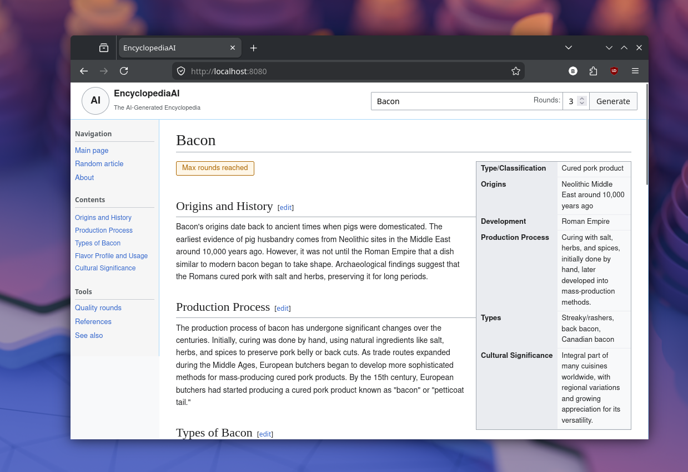

# encyclopedia-ai



An experimental encyclopedia generator that uses AI agents to plan, draft, evaluate, revise, and enhance Wikipedia-style articles.

Nothing is written one-shot. A topic is first turned into a *brief* that fixes
what the article is about, then into an *outline* of sections with the
questions each one has to answer; only then is prose written, one section at a
time, against that plan.

Model calls go through a provider boundary, so the same pipeline runs against a
local Ollama instance or any OpenAI-compatible API such as OpenRouter. Reasoning
models are supported: a model's thinking is streamed on its own channel and
never mixed into the article text.

## Run it

Install:

- Go 1.25 or newer
- Ollama
- `curl`
- The `llama3.1` and `mistral` Ollama models, or whichever models you configure

The convenience script starts Ollama, waits for it to become available, pulls the models, and starts the server:

```bash
./start.sh
```

To run Ollama separately:

```bash
go run ./cmd/server
```

The application listens on `http://localhost:8080` by default. Configuration is available through environment variables:

| Variable | Default | Purpose |
| --- | --- | --- |
| `ENCYCLOPEDIA_ADDR` | `:8080` | HTTP listen address |
| `JOB_WORKERS` | `1` | Jobs generated at once. Local inference is GPU bound |
| `ENCYCLOPEDIA_DB` | — | SQLite file for jobs. Unset keeps them in memory |
| `LLM_PROVIDER` | `ollama` | `ollama` or `openai` |
| `LLM_TEXT_MODEL` | `llama3.1` | Prose generation and revision model |
| `LLM_STRUCTURED_MODEL` | `mistral` | Evaluation, planning, and metadata model |
| `LLM_THINK` | `off` | Reasoning budget: `off`, `on`, `low`, `medium`, `high` |
| `LLM_ATTEMPTS` | `3` | Provider calls allowed per agent call, including repairs |
| `LLM_CONTEXT_TOKENS` | provider default | Context window. Raise this for reasoning models |
| `LLM_TIMEOUT_SECONDS` | `600` | Maximum duration of one model request |
| `LLM_BASE_URL` | provider default | Ollama host, or OpenAI-compatible endpoint |
| `LLM_API_KEY` | — | Required when `LLM_PROVIDER=openai`; `OPENROUTER_API_KEY` also works |
| `ROCR_VISIBLE_DEVICES` | `1` | GPU selection used by `start.sh` |
| `HIP_VISIBLE_DEVICES` | `1` | GPU selection used by `start.sh` |

The previous `OLLAMA_API_URL`, `OLLAMA_TEXT_MODEL`, `OLLAMA_STRUCTURED_MODEL`,
and `OLLAMA_TIMEOUT_SECONDS` names still work. An `OLLAMA_API_URL` that points
at `/api/generate` is accepted and trimmed to the host.

Configuration is resolved once at start-up, so a bad value stops the server
rather than failing on the first request.

### Running against a reasoning model

Locally, pull a model that supports thinking and ask for a trace:

```bash
LLM_TEXT_MODEL=gpt-oss:20b \
LLM_STRUCTURED_MODEL=gpt-oss:20b \
LLM_THINK=high \
LLM_CONTEXT_TOKENS=16384 \
./start.sh
```

**Set `LLM_CONTEXT_TOKENS` when using a reasoning model.** Ollama's default
context window is 4096 tokens, and a single trace can exceed it on its own: the
answer is then truncated away and the agent returns nothing. Measured on
`gpt-oss:20b` at `LLM_THINK=high`, one metadata agent produced 36,000
characters of reasoning and no answer until the window was raised. A larger
window costs VRAM, so on a 16 GB card expect to trade context against model
size.

Against OpenRouter:

```bash
export LLM_PROVIDER=openai
export LLM_API_KEY=sk-...
export LLM_TEXT_MODEL=openai/gpt-oss-120b
export LLM_STRUCTURED_MODEL=openai/gpt-oss-120b
export LLM_THINK=high
go run ./cmd/server
```

Model identifiers should be checked against the provider's catalogue. A model
that cannot produce a reasoning trace is detected on its first call and used
without one, so `llama3.1` and `mistral` keep working with `LLM_THINK` set.

## Generation flow

```
Intake → Outline → Lead → Section* → [Evaluate → Compare → Plan → Revise]* → Metadata
```

**Intake** decides what the article is (title, subject sentence, what is in
scope, and which other readings of the same words were set aside). **Outline**
plans the sections, each with a purpose, a word target, and the specific
questions it must answer. The article is then written a section at a time,
each one seeing the plan and the draft so far, so sections neither repeat one
another nor drift out of scope. The brief travels with the article through
the rest of the loop: the evaluator and the reviser are both shown the
specification the article was written to.

The outline's `key_questions` are the retrieval layer's entry point — the
things the article has committed to answering.

Generation does not happen inside a request. A reasoning run takes tens of
minutes, which no load balancer or mobile connection will hold open, so a
request enqueues a job and clients follow its event log.

| Endpoint | Purpose |
| --- | --- |
| `POST /api/articles` | Enqueue a job. Returns `202` with the job and a `Location` header |
| `GET /api/articles/{id}` | The job, including its `ArticleState` once finished |
| `GET /api/articles/{id}/events` | The job's event log as SSE |
| `POST /api/articles/{id}/cancel` | Stop a queued or running job |

```bash
curl -X POST localhost:8080/api/articles \
  -H 'Content-Type: application/json' \
  -d '{"topic":"Bacon","max_rounds":3}'
```

### Following a job

Every event carries a contiguous `id`, so a client that drops out resumes
exactly where it stopped by sending the standard `Last-Event-ID` reconnect
header, or `?from=<seq>`:

```bash
curl -N localhost:8080/api/articles/<id>/events
curl -N -H 'Last-Event-ID: 51' localhost:8080/api/articles/<id>/events
```

| Event | Payload |
| --- | --- |
| `token` | `{stream, text}` — a chunk of that stream's answer |
| `reasoning` | `{stream, text}` — a chunk of its reasoning trace |
| `restart` | `{stream}` — discard this stream; the authoritative text follows |
| `phase` | `{name, detail, index, total}` — the pipeline step now running |
| `brief` | The intake brief, parsed |
| `outline` | The section plan, parsed |
| `round` | The completed round, with its scores |
| `converged` | The loop reached the quality threshold |
| `done` | The final `ArticleState` |
| `error` | `{message, state}` — the failure and any partial state |
| `closed` | The job is finished; the stream ends |

Streams are `brief`, `outline`, `article`, `evaluation`, `revision_plan`,
`references`, `infobox`, `seealso`, and `category`.

Only the `article` stream is meant to be painted as it arrives. The others
carry JSON, and a half-arrived JSON object is not something to render — the
brief and the outline are delivered parsed, as their own events.

Token deltas are coalesced before they are logged. One reasoning run produced
over eleven thousand deltas; batching turns that into a few dozen events
without changing what the client reconstructs.

Replaying a job's log from the beginning rebuilds the article exactly: the
server repaints the `article` stream from its own copy whenever the two could
otherwise drift, so a `restart` is always followed by the authoritative text. A
client that arrives after the job finished can skip the log entirely and read
`GET /api/articles/{id}`.

`max_rounds` is the maximum number of evaluated rounds, not the number of
unverified revisions. A final round is never revised without being evaluated.

A revision that kept less than 75% of the article is thrown away and the loop
stops, because the reviser summarized rather than revised. The evaluator does
not catch this on its own — in one run it scored a revision that had dropped
half the coverage 9.2 against the original's 8.4.

## Development

Run the checks locally:

```bash
GOCACHE=/tmp/encyclopedia-ai-go-cache go test -race ./...
GOCACHE=/tmp/encyclopedia-ai-go-cache go vet ./...
test -z "$(gofmt -l .)"
node --check web/static/script.js
```

The provider boundary is injectable, so the `llm`, `ai`, orchestration, and HTTP tests run without Ollama or a network. The browser supports canceling generation, reviewing round drafts, applying a local edit, and following related topics.

## Roadmap

`docs/DEPLOYMENT.md` records the deployment plan and the milestone ladder
towards a research-backed pipeline: outlining, retrieval, grounded drafting,
and claim verification.

## Limitations

Generated prose and metadata are not independently verified. In particular, the current references agent produces candidate references rather than retrieved or validated citations. Source retrieval and evidence application are intentionally separate future work.

Without `ENCYCLOPEDIA_DB` jobs live in process memory and are lost on restart.
With it they are kept in SQLite, and a job left running by a crash is marked
failed at start-up rather than waiting for a worker that no longer exists.
Browser edits remain local only.
